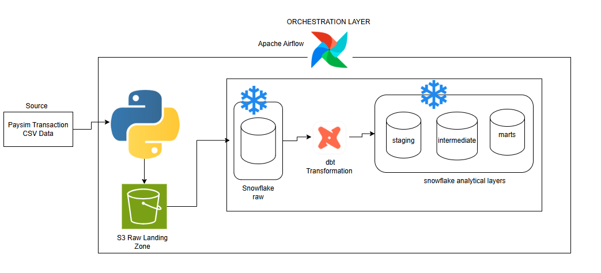
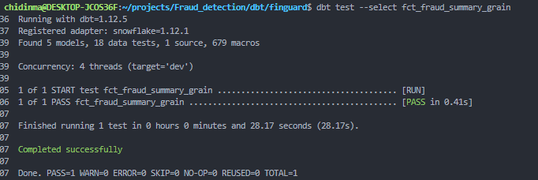
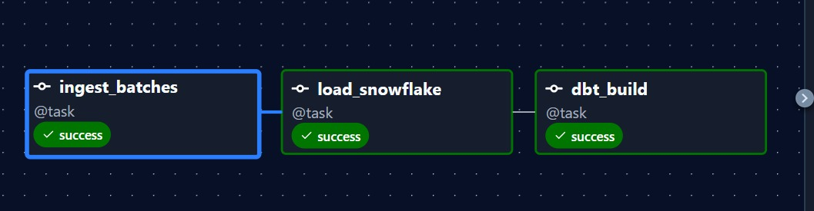

# FinGuard — Batch Incremental Fraud Monitoring Data Pipeline

**A batch-oriented data engineering pipeline for ingesting, storing, transforming, validating, and serving mobile-money transaction data for fraud monitoring and historical analysis.**

---

##  Business Scenario

A financial services company processes a growing volume of mobile-money transactions.

The company's fraud and analytics teams need reliable transaction data to:

- investigate suspicious transactions
- understand fraud patterns
- analyse transaction behaviour
- monitor historical fraud activity
- support customer and transaction risk analysis
- build downstream analytical reports and dashboards

The company receives transaction data in recurring batches but does not have a dependable data pipeline for incrementally ingesting, storing, transforming, validating, and serving that data for analysis.

The business requirement is therefore not simply to move files from one location to another.

The company needs a reliable data platform that can:

1. receive new transaction batches
2. preserve the raw data
3. identify and process only new batches
4. load the data efficiently into a warehouse
5. transform raw transactions into trusted analytical datasets
6. validate the resulting data
7. make the curated data consistently available to downstream analysts and BI tools

FinGuard was designed as the data engineering solution for this requirement.

---

## Data Engineering Problem

The core engineering question was:

> **How can a financial company build a reliable batch data pipeline that incrementally ingests transaction data, preserves the raw source, loads it efficiently into a cloud data warehouse, transforms it into trusted analytical datasets, and makes the data available for downstream fraud analysis?**

The solution needed to address several engineering concerns:

- incremental ingestion

- duplicate prevention

- raw data preservation

- cloud storage

- scalable warehouse loading

- data transformation

- dimensional modelling

- data quality

- orchestration

- reproducibility

- failure and execution-environment issues

---

## Proposed Solution

FinGuard is a batch incremental data engineering pipeline that moves transaction data through the following architecture:



Apache Airflow orchestrates the main pipeline:

Ingest_batches >> load_snowflake >> dbt_build

The pipeline stops at the curated data marts.

The downstream analyst or BI team can consume these marts to build reports, dashboards, fraud analysis, or other analytical products.

## Why Batch Instead of Streaming?

The architecture was driven by the business requirement.

For this project, transaction data is delivered as recurring files for analytical processing. The requirement does not call for individual transactions to be processed immediately as events arrive.

Therefore, FinGuard uses:

- scheduled batch ingestion
- incremental processing
- persistent processing state
- cloud object storage
- warehouse-based processing
- scheduled transformation
- workflow orchestration

A streaming architecture using technologies such as Kafka and Debezium would be appropriate for a different requirement where the business needs continuous event ingestion and near-real-time processing.

For this use case, introducing streaming infrastructure would add operational complexity without solving a requirement defined around batch analytical processing.

The architectural decision was therefore based on the business requirement, not on choosing the most complex technology available.

## Technology Decisions

| Technology     | Purpose                                                                |
| -------------- | ---------------------------------------------------------------------- |
| Python         | Batch processing, ingestion logic, validation and automation utilities |
| AWS S3         | Durable raw landing zone for transaction batches                       |
| Snowflake      | Cloud data warehouse and analytical storage                            |
| dbt            | SQL transformation, modelling, testing and lineage                     |
| Apache Airflow | Workflow orchestration and scheduling                                  |
| Docker         | Reproducible Airflow execution environment                             |
| SQLite         | Persistent ingestion manifest for batch tracking                       |
| Git/GitHub     | Version control and project management                                 |

The technologies were selected according to the responsibilities of each layer rather than simply adding tools to the stack.

## Incremental Batch Ingestion

A major requirement of FinGuard is that previously processed transaction batches should not be uploaded again.

The pipeline maintains an ingestion manifest containing information about successfully processed files.

For each incoming batch, FinGuard calculates a SHA-256 checksum.

The checksum is then checked against the ingestion manifest.

The core implementation is:

```python
checksum = calculate_sha256(batch_file)

if self.manifest.is_processed(checksum):
    logger.info(
        "Skipping already processed batch. File=%s",
        batch_file.name,
    )
    continue
```
If the checksum has not been processed previously:

- the batch is uploaded to S3
- the upload result is recorded
- the file checksum is stored
- the batch is marked as successfully processed

This makes the ingestion process idempotent at the file level.

Without persistent ingestion state, rerunning the pipeline could result in previously processed files being treated as new files.

## AWS S3 Raw Landing Zone

Amazon S3 is used as the raw landing zone.

The implemented bucket is organised as:

```text
fraud-detection-raw-chidinma-2026/
└── raw/
    └── paysim/
        └── transactions/
            └── batches/
                ├── transactions_batch_0001.csv
                ├── transactions_batch_0002.csv
                ├── transactions_batch_0003.csv
                ├── ...
                └── transactions_batch_0011.csv
```
The current transaction dataset contains:

11 transaction batches
1,048,575 transaction records

The raw layer preserves the source data before warehouse transformation.

This creates a separation between:

source/raw data
warehouse storage
analytical transformation

S3 is responsible for storage.

Snowflake is responsible for warehouse processing.

dbt is responsible for transformation.

## Snowflake Warehouse Loading

Instead of downloading the complete dataset to the local machine and then pushing it into Snowflake, FinGuard uses Snowflake's ability to read directly from Amazon S3.

The flow is:

**AWS S3 ---> Anowflake External Stage --> Snowflake COPY INTO --> RAW.TRANSACTIONS**


This keeps the local machine from becoming the data-transfer layer.

```python 

 #creating the external stage

CREATE OR REPLACE STAGE FRAUD_ANALYTICS.RAW.PAYSIM_STAGE
  URL = 's3://<bucket>/raw/paysim/'
  STORAGE_INTEGRATION = FINGUARD_S3_INTEGRATION
  FILE_FORMAT = (
    TYPE = CSV
    SKIP_HEADER = 1
    FIELD_OPTIONALLY_ENCLOSED_BY = '"'
  );
  ```
The stage can be inspected with:

`LIST @FRAUD_ANALYTICS.RAW.PAYSIM_STAGE;`

```python
# Loading the transaction data

COPY INTO FRAUD_ANALYTICS.RAW.TRANSACTIONS
FROM @FRAUD_ANALYTICS.RAW.PAYSIM_STAGE
FILE_FORMAT = (
    TYPE = CSV
    SKIP_HEADER = 1
    FIELD_OPTIONALLY_ENCLOSED_BY = '"'
)
PATTERN = '.*transactions_batch_.*\.csv';
```

The RAW table was verified to contain:

1,048,575 rows

Why this design?

The orchestration server should not become responsible for carrying the complete dataset.

Airflow orchestrates the operation while Snowflake performs the warehouse loading.

Conceptually:

```text
Airflow 
   │
   │ orchestrates
   ▼
Snowflake
   │
   │ reads directly from
   ▼
AWS S3
```

This separates orchestration from data movement and processing. 

## dbt Transformation Architecture

After loading the source data into Snowflake RAW, dbt transforms the data through multiple layers.

```text
RAW 
 |
 STAGING
 │
 INTERMEDIATE
 │
 MARTS
```

Each layer has a defined responsibility.

STAGING

The staging layer provides a cleaned and consistently named representation of the raw source.

The raw source is declared in dbt as:

```yml
    version: 2

sources:
  - name: raw
    database: FRAUD_ANALYTICS
    schema: RAW
    tables:
      - name: transactions
```

The staging model references this source rather than querying the raw table throughout the project.

INTERMEDIATE

The intermediate layer contains business and transformation logic that prepares the data for analytical models.

Because the source dataset does not provide a dedicated transaction identifier, FinGuard creates a deterministic transaction key from attributes that describe the transaction event:

- transaction step
- originating account
- destination account
- transaction amount

These attributes were selected because they collectively describe the transaction event and provide a consistent way to identify transaction records across the transformation layers.

The intermediate layer also derives transaction-level measures such as *balance changes and fraud-related amounts.*

This keeps transformation logic separate from the final analytical marts.


## Analytical Data Marts

The final dbt layer contains curated analytical datasets.

### FCT_TRANSACIONS

    Grain:

One row per transaction.

This provides transaction-level fact data for detailed analysis.

### DIM_TRANSACTION_TYPE

Provides transaction-type attributes for analytical grouping and filtering.

### FCT_FRAUD_SUMMARY

Provides aggregated fraud-related information.

    Grain:

One row per transaction_step × transaction_key_type.

Defining the grain explicitly is important because it determines what one row represents and provides the basis for data quality testing.

## Data Quality and Testing

Data quality is treated as part of the pipeline rather than as a separate activity after transformation.

FinGuard validates data at different stages.

Examples include:

source validation
schema validation
row-count reconciliation
duplicate/grain validation
dbt model tests
warehouse load verification
ingestion manifest tracking
Grain Validation

For the fraud summary mart, a singular dbt test checks that the declared grain is not duplicated.

``` sql
SELECT
    transaction_step,
    transaction_key_type,
    COUNT(*) AS row_count
FROM {{ ref('fct_fraud_summary') }}
GROUP BY
    transaction_step,
    transaction_key_type
HAVING COUNT(*) > 1;
```

If this query returns a row, the declared grain has been violated.

The test is executed with:

`dbt test --select fct_fraud_summary_grain`

The test passed successfully.

 c

## Airflow Orchestration

Apache Airflow orchestrates the complete pipeline.

The DAG is named:

*finguard_pipeline*

The workflow contains three major tasks:

```text
    ingest_batches
       │
       ▼
    load_snowflake
       │
       ▼
    dbt_build
```

The dependency is defined explicitly:

ingestion = ingest_batches()

snowflake_load = load_snowflake()

transformation = dbt_build()

ingestion >> snowflake_load >> transformation

This ensures that:

transaction batches are ingested first
Snowflake loading occurs after ingestion
dbt transformations occur after the warehouse load

The DAG is scheduled daily.

The successful Airflow run demonstrates the complete execution path:

```test
S3 ingestion
      ↓
Snowflake loading
      ↓
dbt transformation
```
with all three tasks completing successfully.



## Docker Execution Environment

Airflow runs using Docker Compose.

The project uses the official Apache Airflow Docker Compose structure with a custom FinGuard image.

The custom Dockerfile is intentionally small:

```dockerfile
FROM apache/airflow:3.3.2

COPY requirements-airflow.txt /requirements-airflow.txt

RUN pip install --no-cache-dir -r /requirements-airflow.txt

```

The custom image installs the dependencies required by the FinGuard pipeline, including:

- AWS S3 access through boto3
- Snowflake connectivity through snowflake-connector-python
- dbt transformations through dbt-core and dbt-snowflake
- Environment configuration through python-dotenv

## Major Challenge Faced

One of the main implementation challenges occurred when the ingestion pipeline was moved from local execution into Airflow running inside Docker.

The ingestion manifest originally used a relative SQLite path:

`data/metadata/ingestion_manifest.db`

This worked when the pipeline was executed from the FinGuard project directory.

However, Airflow runs inside a container with a different working directory.

The relative path therefore resolved to a different location inside the container.

Airflow created and used a new empty manifest database instead of the existing mounted ingestion state.

As a result, previously processed batches were not recognised and the pipeline attempted to process them again.

The issue was resolved by changing the manifest implementation to derive the database path from the location of the Python module rather than from the current working directory.

This ensured that the same mounted manifest database was used consistently across local and Airflow execution.

The incident highlighted an important engineering principle:

A pipeline's execution environment is part of the system.

File paths, mounted volumes, credentials, environment variables, dependencies, and working directories all need to be considered when moving a pipeline between local and containerised execution.


# Future Extensions

The current architecture can be extended if the business requirement changes.

Real-Time Fraud Processing

If the company later requires transaction-level processing with low latency, a streaming architecture could be introduced using technologies such as Kafka and Debezium.

For example:

```text 
Operational Database
        │
        ▼
     Debezium
        │
        ▼
      Kafka
        │
        ▼
Streaming Processing
        │
        ▼
Real-Time Fraud Detection
```

This would represent a different business requirement from the current batch architecture.


## Key Lessons

Building FinGuard highlighted several practical lessons that go beyond learning individual tools.

1. Architecture should follow the business requirement

The project uses batch processing because the source data and analytical requirement are batch-oriented.

The most complex architecture is not automatically the most appropriate architecture.

2. Orchestration is different from processing

Airflow coordinates the workflow.

Snowflake performs warehouse processing.

S3 stores raw data.

dbt performs transformations.

Each component has a defined responsibility.

3. Raw data should remain separate from transformed data

Keeping the source data in S3 provides a stable foundation for downstream transformations and future reprocessing.

4. Incremental processing requires persistent state

Knowing whether a file has already been processed is essential when designing a reliable batch ingestion process.

The ingestion manifest provides this state.

5. The execution environment is part of the system

A pipeline that works locally can behave differently inside Docker or Airflow.

Working directories, mounted volumes, credentials, environment variables and dependencies must all be considered when designing an orchestrated pipeline.

6. Data quality belongs inside the pipeline

Validation should not be treated as an afterthought.

The pipeline should provide evidence that the data remains structurally and logically correct as it moves through the system.

The pipeline ends at the curated analytical marts. These datasets are intended for downstream consumption by fraud analysts, risk teams, and BI/reporting tools. 


## Author

Chidinma Okeh

A Data Engineer focused on building reliable data pipelines, cloud data platforms, analytical data models and automated data workflows.