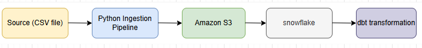
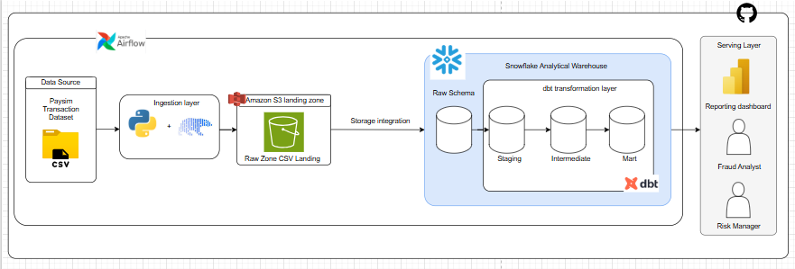

# AWS Foundation Design

## Overview

The AWS layer forms the storage foundation of the Fraud Detection Analytics Platform.

The purpose of introducing AWS into this project is to create a secure and reliable landing location for transaction data before it is loaded into Snowflake for analytical processing.

The platform follows a layered data architecture where raw transaction data is first collected, stored, transformed, and then exposed for reporting and analytics.

The data flow is:

Amazon S3 acts as the data lake storage layer, while Snowflake and dbt handle analytical processing and transformation.

---

# Purpose of AWS Layer

The AWS layer is responsible for providing the cloud storage and security foundation required by the data pipeline.

In this fraud analytics project, transaction data needs a reliable landing area before analytical processing begins.

Using AWS allows the platform to:

- Store raw transaction files separately from analytical data
- Preserve the original source data for auditing and reprocessing
- Support future automation through pipeline orchestration
- Provide controlled access to sensitive transaction information

---

# Why Amazon S3 is Used

Amazon S3 is used as the raw data landing zone for the fraud analytics platform.

The transaction dataset is first stored in S3 before loading into Snowflake because the raw data should be preserved independently from the transformation process.

This approach provides:

- A central location for incoming transaction files
- Ability to reload data if transformations fail
- Separation between storage and analytical processing
- Scalable storage as transaction volume grows
- Integration with future data pipelines

For this project, S3 acts as the landing zone between the ingestion process and the data warehouse. No analytical transformations are performed inside S3.
Transformation logic is handled by dbt after data is loaded into Snowflake.

---

# S3 Storage Architecture

The S3 bucket is organized using a layered structure:

fraud-detection-platform/

raw/

    transactions/

        paysim_transactions.csv

archive/

    transactions/

## Raw Layer

The raw layer contains the original transaction files received from the source system.

No transformations are applied at this stage.

Purpose:

- Maintain the original dataset
- Support data recovery
- Enable future reprocessing
- Allow reprocessing when required 

## Archive Layer

The archive layer stores previous versions of files to maintain historical records.

## S3 Versioning
S3 versioning is enabled to protect against accidental deletion or overwriting of objects.

---

# Why IAM is Needed

IAM is used to control access between users, applications, and AWS resources.

In this project, the ingestion pipeline needs permission to upload transaction files into S3.

Instead of storing AWS credentials directly inside Python code, IAM roles provide a secure way for applications to interact with AWS services.

The ingestion process will use an IAM role with only the permissions required:

- Upload files to S3
- Read files from S3
- View bucket contents

This follows the principle of least privilege, where each component receives only the access it needs.

---

# Security Considerations

Because transaction data represents financial activity, security is an important part of the design.

The AWS environment will implement:

- Private S3 bucket access
- Encryption for stored data
- IAM-based access control
- No hardcoded AWS credentials

---

# Future Implementation

The AWS foundation will later support:

- Python-based data ingestion
- Airflow workflow automation
- Snowflake data loading
- dbt transformation workflows

The final architecture will allow transaction data to move through the platform:

