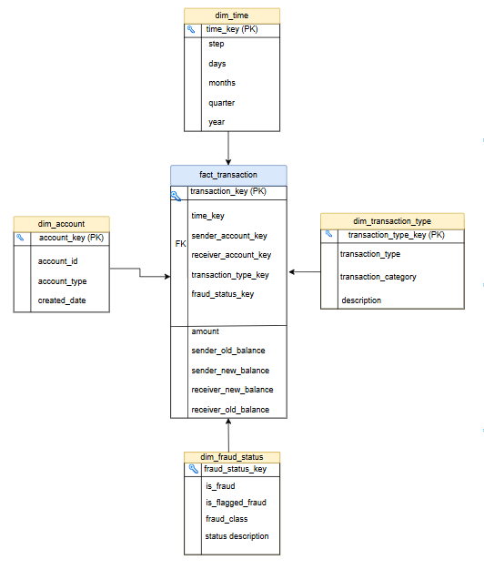

# Data Warehouse Design

## Business Process

The business process being modeled is financial transactions.

Each transaction represents a business event that may or may not be fraudulent.

---

## Fact Table

### fact_transactions

#### Grain

One row in the fact table represents one transaction event.

#### Measures

* amount
* sender_old_balance
* sender_new_balance
* receiver_old_balance
* receiver_new_balance

---

## Dimension Tables

### dim_transaction_type

Stores transaction categories such as:

* PAYMENT
* TRANSFER
* CASH_OUT
* CASH_IN
* DEBIT

### dim_account

Stores account identifiers.

### dim_time

Stores transaction time information.

### dim_fraud_status

Stores fraud classification attributes.

---

## Star Schema (Dimensional Modelling)

